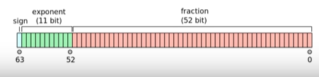

# Number 오브젝트
## 1. IEEE 754
- IEEE(Institute of Electrical and Electronics Engineers)
- 자바스크립트는 IEEE 754에 정의된  
  + 64bit 부동 소수점으로 수를 처리
    + double-precision floating-point  
    format numbers
  + 64bit로 최소값과 최대값을 처리
- 정수와 실수를 구분하지 않음
  + 1을 1.0으로 처리
  + 1과 1.2를 더할 수 있음
## 2. 64비트 구성
- Sign 비트
  + 63: 1비트
  + 값이 0이면 양수, 1이면 음수
- 지수(exponent)
  + 52~62: 11비트
- 가수(fraction)
  + 0 ~51: 52비트 + 1(Sign 비트): 53비트

## 3. 값을 구하는 방법
- 비트 값은 0 아니면 1
- 2^승 값을 더해 값을 구함
  + 0비트 부터 1, 1, 1 이면
  + 1(2^0) + 2(2^1) + 4 = 7

  ## 4. Number 상수
|상수 이름|상수 값|
|---|---|
|Number.MAX_SAFE_INTEGER|9007199254740991 (2의 53승 -1)|
|Number.MIN_SAFE_INTEGER|-9007199254740991 (-(2의 53승 -1))|
- **safe integer**란
  + 지수(e)를 사용하지 않고 나타낼 수 있는 값
  + 2의 64승이 아닌 2의 53승
- `Number.MAX_SAFE_INTEGER`
  + **safe integer 최대값**
```js
console.log(Number.MAX_SAFE_INTEGER);

console.log(Math.pow(2, 53) - 1);

[실행 결과]
9007199254740991
9007199254740991
```
- `Number.MIN_SAFE_INTEGER`
  + **safe integer 최솟값**
```js
console.log(Number.MIN_SAFE_INTEGER);

console.log(-(Math.pow(2, 53) - 1));

[실행 결과]
-9007199254740991
-9007199254740991
```

## 5. 진수, EPSILON
#### 5.1 Number.EPSILON
- `Number.EPSILON`
  + 아주 작은 값
  + 2.2204460492503130808472633361816E-16
  + 또는 2^-52
- 사용 사례
  + 미세한 값 차이 형태
```js
const total = 0.1 + 0.2;
console.log(total);
console.log(total === 0.3);

[실행 결과]
0.30000000000000004
false
```
1. 0.1과 0.2를 더했는데  
0.3아 아닌 0.300000...4를 출력
2. 값이 같지 않으므로 `false`가 출력
3. JS가 **부동 소수점 처리**를 하기 때문  
IEEE 754
4. 이처럼 **미세한 값차이**로  
일치하지 않을 때 **EPSILON**을 사용함
  + **미세한 값 차이를 같은 값으로 간주**
```js
const value = Math.abs(0.1 + 0.2 - 0.3);
console.log(value < Number.EPSILON);

[실행 결과]
true
```
1. 값 차이가 `Number.EPSILON` 보다  
작으면 `true`를 반환
  + **0 / 0 으로 NaN이 되는 것을 방지**
```js
console.log(0 / 0);
const value = 0 / (0 + Number.EPSILON);
console.log(value);

[실행 결과]
NaN
0
```
1. 0 / 0 은 `Nan`
2. `(0 + Number.EPSILON)` 처럼  
작은 값을 더해 나누면 0이 됨
3. 0 이므로 후속 처리를 할 수 있음

#### 5.2 진수
- **Binary(2진수)**
  + 0b0101, 0B01010 형태로 작성
  + 숫자 0 다음에 b/B 작성하고  
  이어서 0 또는 1로 값을 작성
```js
const value = 0B111;
console.log(value);

[실행 결과]
7
```
- **Octal(8진수)**
  + 0O0105 형태로 작성
  + 숫자 0 다음에 영문 o/O 작성하고  
  이어서 0~7 로 값을 작성
```js
const value = 0o111;
/// 1 + 8 + 64
console.log(value);

[실행 결과]
73
```
## 6 Number 함수
#### 6.1 isNaN()
> is `undefined` 냐? 질문하는 느낌
|구분|데이터(값)|
|---|---|
|형태|`Number.isNaN()`|
|파라미터|비교 대상|
|반환|Nan이면 true, 아니면 false|
- NaN 값의 여부를 체크
  + NaN 값이면 true, 아니면 false 반환
```js
console.log(Number.isNaN("ABC"), isNaN("DEF"));
console.log(Number.isNaN(NaN), isNaN(NaN));
console.log(Number.isNaN(0 / 0), isNaN(0 / 0));
console.log(Number.isNaN("100"), isNaN("200"));

[실행 결과]
 false, true
 true, true
 true, true
 false, false
 ```
 1. 글로벌 오브젝트의 `isNaN("DEF")`  
 값 타입이 아닌 Number가 아닌 것을 체크함
 DEF가 **String 타입**이므로 `true` 반환
 2. NaN과 0/0 은 값이 NaN이므로 `true` 반환
 3. `Number.isNaN("ABC")`  
 값이 NaN가 아니므로 `false` 반환
 4. 글로벌 오브젝트의 `isNaN("200")`  
 값을 숫자로 변환하고 그 결과를 비교함  
 변환한 값이 200이 Number이므로 `false` 반환

 - **NaN 체크 방법**
  + `NaN === NaN`  
  결과가 `false` 이므로 **사용 불가**
  + `isNaN()`, **글로벌 오브젝트**
  + `Number.isNaN()`
  + `Object.is(NaN, NaN)` : `true`

#### 6.2 isInteger()
|구분| 데이터(값)|
|---|---|
|형태| `Number.isInteger()`|
|파라미터| 비교 대상|
|반환| 정수이면 true, 아니면 false|
- 파라미터 값이 정수이면 `true`  
아니면 `false` 반환
- 정수로 인식
```js
console.log(Number.isInteger(0));
console.log(Number.isInteger(1.0));
console.log(Number.isInteger(1.01));

[실행 결과]
true
true
false
```
- 정수가 아닌 것으로 인식
```js
console.log(Number.isInteger("12"));
console.log(Number.isInteger(true));

[실행 결과]
false
false
```
1. 값을 Number로 변환하여 체크하지 않음
2. Number로 변환하면, "12"와 true가  
Number 이므로 정수로 인식됨
  
#### 6.3 isSafeInteger()
|구분|데이터(값)|
|---|---|
|형태| `Number.isSafeInteger()`|
|파라미터| 비교 대상|
|반환| safe 정수이면 true, 아니면 false|

- 파라미터 값이 safe 정수이면 true  
아니면 false 반환
- -(2의 53승 - 1) ~ (2의 53승 -1): `true`
- **true로 인식**
```js
const isSafe = Number.isSafeInteger;
console.log(isSafe(7.0)); // 정수이며, safe 범위에 속함
console.log(isSafe(Number.MAX_SAFE_INTEGER));
console.log(isSafe(Number.MIN_SAFE_INTEGER));

[실행 결과]
true
true
true
```
- **false로 인식**
```js
const isSafe = Number.isSafeInteger;
console.log(isSafe(7.1));
console.log(isSafe("100"));
console.log(isSafe(NaN));
console.log(isSafe(Infinity));

[실행 결과]
false
false
false
false
```
1. 7.1은 정수가 아님
2. 값을 Number로 변환하여 체크하지 않음
3. Number로 변환하면,  
"100"이 Number이므로 정수로 인식됨

#### 6.4 isFinite()
|구분|데이터(값)|
|---|---|
|형태|`Number.isFinite()`|
|파라미터| 비교 대상|
|반환| 유한 값이면 true, 아니면 false|
- 파라미터 값이 유한 값이면 true  
아니면 false 반환
- 글로벌 오브젝트의 `isFinite()`와  
체크 결과가 다름
```js
const num = Number.isFinite,
      global = isFinite;
console.log(num(100), global(200));
console.log(num("70"), global("80"));
console.log(num(true), global(true));

console.log(num(NaN), global(NaN));
console.log(num(undefined), global(undefined));

[실행 결과]
true, true
false, true
false, true
false, false
false, false
```
1. 글로벌 오브젝트의 `isFinite()`는  
파라미터 값을 **Number로 변환**하여 체크함

- 함수는 오브젝트에 속해야 하므로  
Number와 관련된 것은  
**Number 오브젝트**의 함수 사용  
**글로벌 오브젝트**의 함수는 **글로벌 사용**이 목적